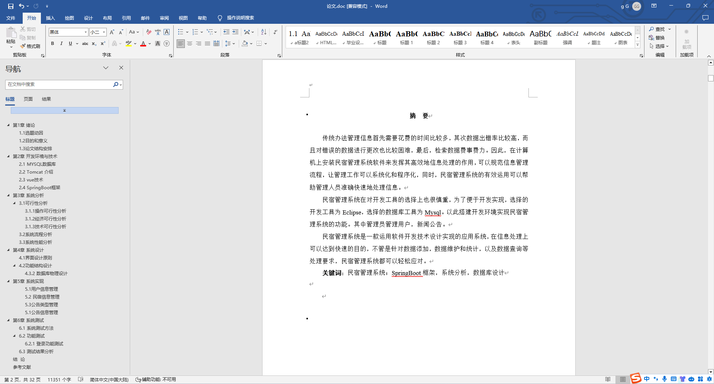
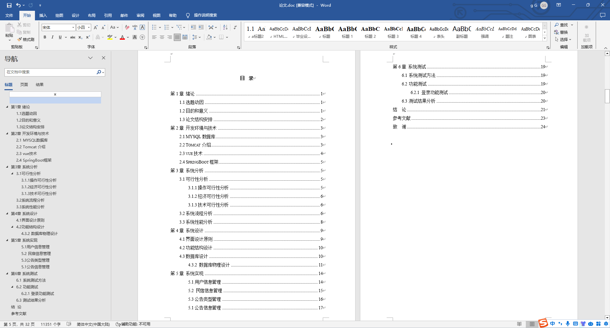
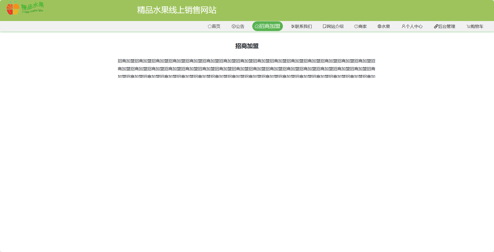
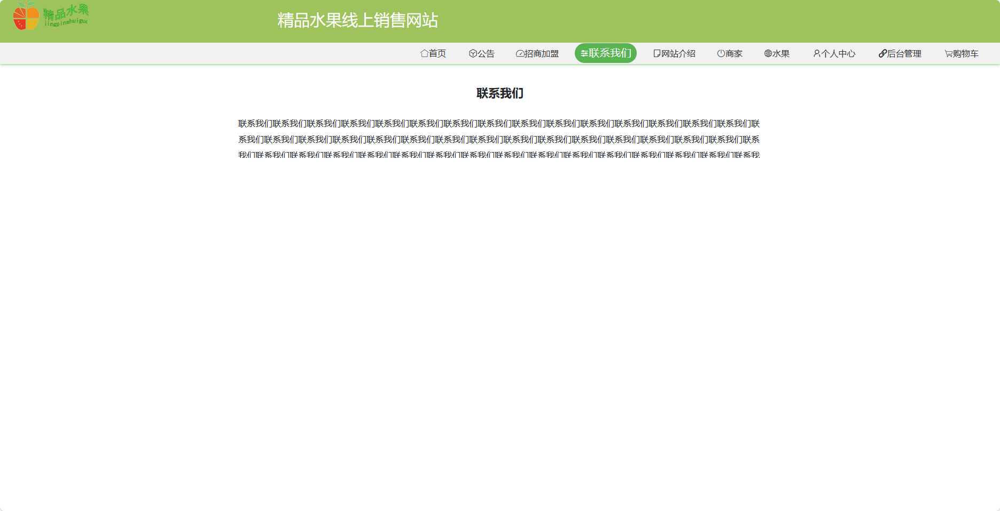
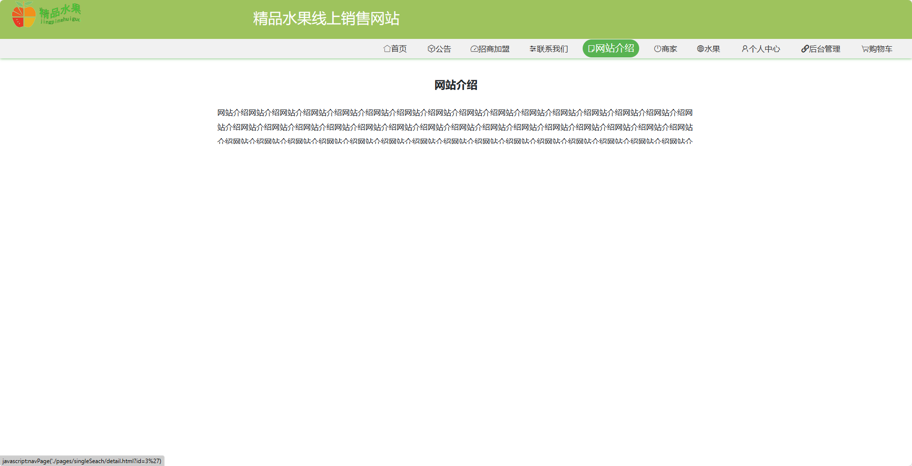
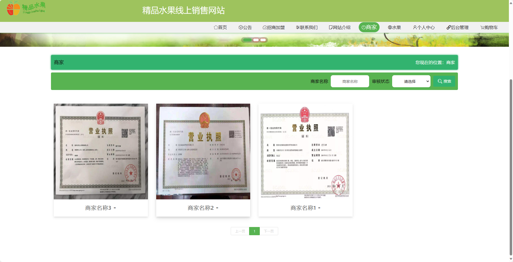
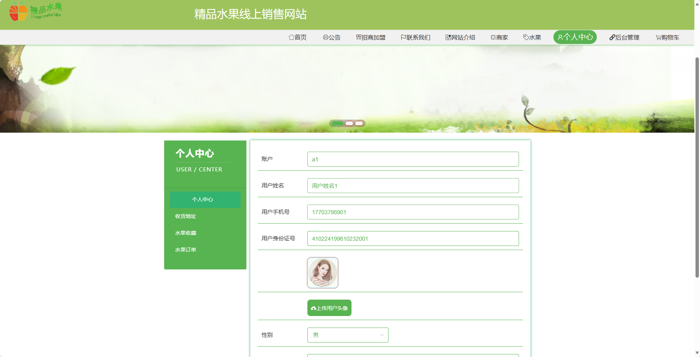
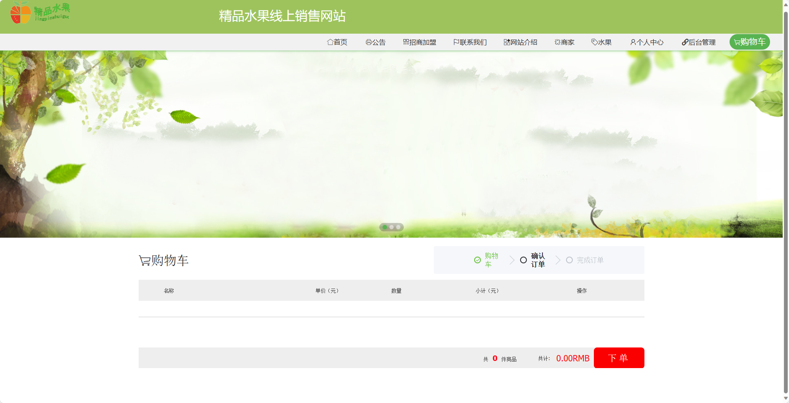

基于SpringBoot的精品水果线上销售网站站（程序+论文）
=
- 完整代码获取地址：从戎源码网 ([https://armycodes.com/](https://armycodes.com/))
- 作者微信：19941326836  QQ：952045282 
- 承接计算机毕业设计、Java毕业设计、Python毕业设计、深度学习、机器学习
- 选题+开题报告+任务书+程序定制+安装调试+论文+答辩ppt 一条龙服务
- 所有选题地址https://github.com/nature924/allProject

一、项目介绍
---
基于Spring Boot框架实现的精品水果线上销售网站，系统包含三种角色：管理员、商家、用户,系统分为前台和后台两大模块，主要功能如下。
### 前台功能：

1. 首页：展示水果的推荐信息和促销活动。
2. 公告：展示网站的公告信息。
3. 招商加盟：介绍招商加盟的政策和流程。
4. 联系我们：提供联系方式和在线留言功能。
5. 网站介绍：详细介绍网站的特色和服务内容。
6. 商家：用户可以查看商家的信息和合作方式。
7. 水果：用户可以浏览水果的详细信息。
8. 个人中心：用户可以管理个人信息、订单记录、收货地址等。
9. 购物车：用户可以将感兴趣的水果添加到购物车。

### 后台功能：

### 用户：

1. 个人中心：管理个人信息。
2. 公告管理：管理公告信息，包括添加、编辑、删除公告等操作。
3. 水果管理：管理水果信息，包括添加、编辑、删除水果等操作。

### 管理员：

1. 个人中心：管理个人信息。
2. 基础数据管理：管理基础数据，包括水果分类、产地信息等。
3. 公告管理：管理公告信息，包括添加、编辑、删除公告等操作。
4. 水果管理：管理水果信息，包括添加、编辑、删除水果等操作。
5. 单页数据管理：管理网站单页信息，如网站介绍、联系方式等。
6. 用户管理：管理注册用户信息，包括查看、冻结、删除用户等操作。
7. 商家管理：管理商家信息，包括添加、编辑、删除商家等操作。
8. 轮播图信息：管理首页轮播图信息，包括添加、编辑、删除轮播图等操作。

### 商家：

1. 个人中心：管理个人信息。
2. 公告管理：管理商家的公告信息，包括添加、编辑、删除公告等操作。
3. 水果管理：管理商家的水果信息，包括添加、编辑、删除水果等操作。

二、项目技术
---
- 编程语言：Java
- 数据库：MySQL
- 项目管理工具：Maven
- 前端技术：VUE、HTML、Jquery、Bootstrap
- 后端技术：Spring、SpringMVC、MyBatis

三、运行环境
---
- 操作系统：Windows、macOS都可以
- JDK版本：JDK1.8以上都可以
- 开发工具：IDEA、Ecplise、Myecplise都可以
- 数据库: MySQL5.7以上都可以
- Tomcat：任意版本都可以
- Maven：任意版本都可以

四、运行截图
---
### 论文截图：

### 程序截图：

